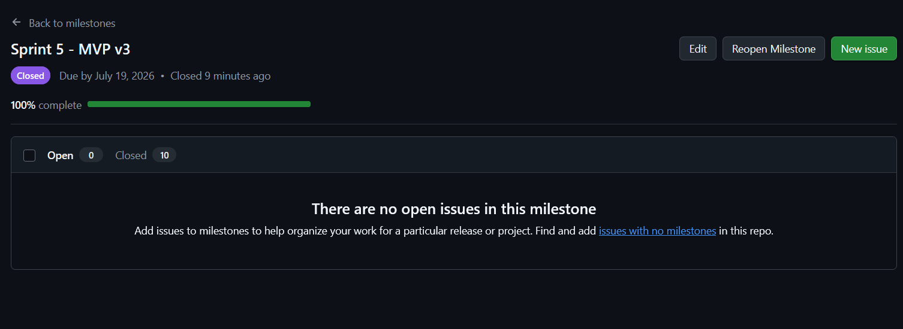
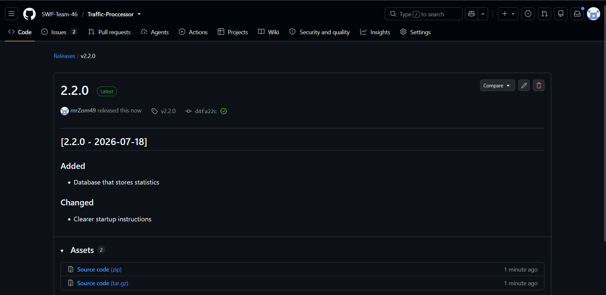
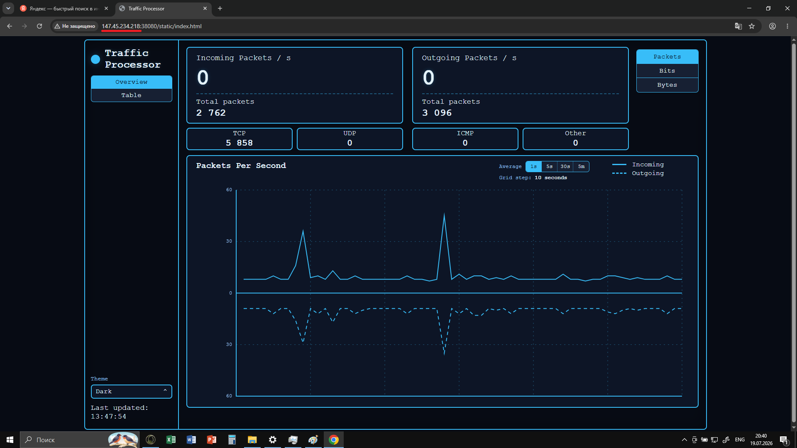

# Week 7 Report - Final Sprint & MVP v3 Delivery

**Project:** Traffic-Processor (SWP-Team-46)  
**Sprint:** Sprint 5 (final)  
**Report Period:** Week 7 (follow‑up & handover)  
**Status:** [replace with actual status, e.g., MVP v3 Delivered / Handover in progress]

---

## 1. Week 6 Report (Previous Sprint)

[Week 6 Report](/reports/week6/README.md)

---

## 2. Product Backlog (Full View)

[Product Backlog - GitHub Issues](https://github.com/SWP-Team-46/Traffic-Proccessor/issues?q=is%3Aissue)  
All open and closed issues, prioritised by the Product Owner

---

## 3. Sprint 5 Backlog Board (Sprint View)

[Sprint 5 Board](https://github.com/orgs/SWP-Team-46/projects/5)

---

## 4. Sprint 5 Milestone

[Sprint 5 Milestone](https://github.com/SWP-Team-46/Traffic-Proccessor/milestones/5) - contains all issues and pull requests targeted for this final sprint

---

## 5. Sprint 5 Goal, Dates, and Scope Summary

- **Sprint Goal:** Final touches for customer handover
- **Sprint Dates:** 2026-07-13 - 2026-07-19
- **Short Scope Summary:** Complete PBIs based on customer feedback, make final touches on the project

---

## 6. Total Sprint 5 Size in Story Points

**Total sprint size:** 8 Story Points

---

## 7. Summary of Week 7 Follow‑up Maintenance and Final MVP v3 Changes

- Database was added
- UI and backend were tailored to match the new conditions
- Documentation was updated

---

## 8. Final Product Access Artifact

**[Web-dashboard](http://147.45.234.218:38080/static/index.html)**

---

## 9. Current Access / Run Instructions

[README#Access-The-Product](https://github.com/SWP-Team-46/Traffic-Proccessor#access-the-product)

---

## 10. README

[README.md](/README.md) - contains project overview, setup, build, and deployment instructions

---

## 11. CONTRIBUTING

[CONTRIBUTING.md](/CONTRIBUTING.md) - guidelines for contributing, coding standards, and pull request process

---

## 12. AGENTS

[AGENTS.md](/AGENTS.md) - describes the AI/ML agent architecture (if applicable) or other automation components

---

## 13. Customer Handover Document

[docs/customer-handover.md](/docs/customer-handover.md) - the official handover package delivered to the customer

---

## 14. Hosted Documentation Site

[Hosted Documentation Site](https://github.com/SWP-Team-46/Traffic-Proccessor/tree/main/docs)

---

## 15. Final Transition Outcome Summary

**Customer‑Confirmation Status:** Confired with Follow-up Points

---

## 16. Summary of Transferred / Delegated Materials

[Link to GitHub repository](/docs/customer-handover.md)

---

## 17. Remaining Transition Blockers / Limitations / Support Expectations

Only limitations that are left:

- Data from multiple containers is aggregated rather than separated
- TP does not work correctly under significant network lag

---

## 18. Customer‑Independent Use / Deployment Evidence

[replace with a summary of any evidence that the customer has deployed or used the system independently; e.g., screenshots, logs, or confirmation email]

---

## 19. Customer Feedback Response Table (Sprint 5 Follow‑up Work)

| Feedback / Issue | Response / Action | Status |
|------------------|-------------------|--------|
| **Data attribution by container** | Implement tagging of data at the database level with processor/container ID to allow per-container filtering in the UI | TBD |
| **Database reset handling** | Either fix the reset functionality for the new version or remove/replace it with a time-window based approach | Resolved |
| **VM-to-VM compatibility** | Continue work on adding cross-VM support | TBD |

---

## 20. Week 7 UAT / Customer‑Trial Results

UATs were performed by the customer, all of which have passed

---

## 21. Final SemVer Release (MVP v3)

[Final release](https://github.com/SWP-Team-46/Traffic-Proccessor/releases/tag/v2.2.0)

---

## 22. CHANGELOG

[CHANGELOG.md](/CHANGELOG.md)

---

## 23. Public Sanitized Demo Video

[Link to Demo](https://drive.google.com/file/d/1qIGM15IDr53qgfzRT-NrpkvN95DilL9P/view)

---

## 24. Demo Day Preparation Summary

[replace]

---

## 25. Sprint Review Transcript / Notes

[Sprint Review Summary](/reports/week7/sprint-review-transcript.md)

---

## 26. Sprint Review Summary

[Sprint Review Summary](/reports/week7/sprint-review-summary.md) - detailed meeting summary

---

## 27. Reflection

[Reflection](/reports/week7/reflection.md) - team reflection

---

## 28. Retrospective

[Retrospective](/reports/week7/retrospective.md) - what went well and what could be improved

---

## 29. LLM Report

[LLM Report](/reports/week7/llm-report.md) - summary of LLM usage during development

---

## 30. Final Product Status

All planned features for MVP v3 are implemented and tested project is ready for use, although customer addressed some points that could be improved on

---

## 31. Contribution Traceability Table

| Team member | Issues / planning | PRs / implementation | Review / integration activity | Testing / quality work | Documentation / transition / deployment |
|---|---|---|---|---|---|
| **LimpingCoronation** | Addressed **#17 – US-06 Traffic Statistics History** through the database/CNSS work. ([github.com](https://github.com/SWP-Team-46/Traffic-Proccessor/pull/127)) | **#127** packet-state database snapshot (closed); **#128** database/CNSS update (14 commits, merged 16 July). ([github.com](https://github.com/SWP-Team-46/Traffic-Proccessor/pull/127)) | — | #128 included PostgreSQL configuration for CI testing and finished with **2 checks passed**. ([github.com](https://github.com/SWP-Team-46/Traffic-Proccessor/pull/128)) | Dependency/Poetry fixes and GitHub Actions workflow corrections were included in #128. ([github.com](https://github.com/SWP-Team-46/Traffic-Proccessor/pull/128)) |
| **jan-ajata** | Implemented and closed **#135 – PBI-12**, retrieving database statistics for selected time windows. ([github.com](https://github.com/SWP-Team-46/Traffic-Proccessor/pull/140)) | **#139** database-backed graph/UI changes (closed); **#140** frontend graph averages (merged); **#144** reset-button removal (merged). ([github.com](https://github.com/SWP-Team-46/Traffic-Proccessor/pull/139)) | Approved **#128** and **#138**; merged both changes into `main`. ([github.com](https://github.com/SWP-Team-46/Traffic-Proccessor/pull/128)) | #140 completed with **2 checks passed**; #144 completed with **1 of 2 checks passed**. ([github.com](https://github.com/SWP-Team-46/Traffic-Proccessor/pull/140)) | Integrated the database/CNSS update and deployment Makefile into `main` through #128 and #138. ([github.com](https://github.com/SWP-Team-46/Traffic-Proccessor/pull/128)) |
| **TimLih-h** | Opened **#141 – PBI-13**, defining support for distinguishing multiple Traffic Processors by database ID. ([github.com](https://github.com/SWP-Team-46/Traffic-Proccessor/issues/141)) | Authored **#138**, a deployment-focused Makefile with backend, attach, detach, logs and stop commands. ([github.com](https://github.com/SWP-Team-46/Traffic-Proccessor/pull/138)) | Approved **#128, #140, #143 and #144**; merged #140, #142 and #143 and corrected documentation PR base branches. ([github.com](https://github.com/SWP-Team-46/Traffic-Proccessor/pull/128)) | Updated `user-acceptance-tests.md`; #138 and #140 each completed with **2 checks passed**. ([github.com](https://github.com/SWP-Team-46/Traffic-Proccessor/pull/130)) | Updated customer-handover material, README, UAT documentation and architecture/sequence diagrams in #130; supplied deployment instructions through #138. ([github.com](https://github.com/SWP-Team-46/Traffic-Proccessor/pull/130)) |
| **mrZom49** | Opened **#129 and #131–#136** for the week-seven report, reflection, meeting summary, handover, presentation and reporting work; closed **#17, #15, #13 and #135**. ([github.com](https://github.com/SWP-Team-46/Traffic-Proccessor/issues?q=is%3Aissue+updated%3A2026-07-13..2026-07-19)) | Authored **#130** Week 7 report (open) and **#137** README update (merged); merged **#144**. ([github.com](https://github.com/SWP-Team-46/Traffic-Proccessor/pull/130)) | Approved **#128** and **#144**. ([github.com](https://github.com/SWP-Team-46/Traffic-Proccessor/pull/128)) | Updated `testing.md`, the main CI workflow and link-checking workflow in the report branch. ([github.com](https://github.com/SWP-Team-46/Traffic-Proccessor/pull/130)) | Updated customer handover, roadmap, README and CHANGELOG, and coordinated the customer-facing Week 7 report and sprint milestone. ([github.com](https://github.com/SWP-Team-46/Traffic-Proccessor/pull/130)) |
| **inseeee** | Contributed reflection and retrospective deliverables to the Assignment 6/week-seven reporting work. ([github.com](https://github.com/SWP-Team-46/Traffic-Proccessor/pull/130)) | Authored **#142** Assignment 6 reflection and **#143** Assignment 7 retrospective; both merged on 19 July. ([github.com](https://github.com/SWP-Team-46/Traffic-Proccessor/pull/142)) | — | For #142, checked Markdown formatting and absence of private links/secrets; for #143, checked clarity, conciseness and formatting. ([github.com](https://github.com/SWP-Team-46/Traffic-Proccessor/pull/142)) | Authored `reflection.md` and `retrospective.md`; both were incorporated into the Week 7 report branch. ([github.com](https://github.com/SWP-Team-46/Traffic-Proccessor/pull/130)) |

---

## 32. Embedded Screenshots (Week 7 Evidence)

<!--
1. Link to `reports/week6/README.md`.
2. Link to the Product Backlog board or view.
3. Link to the Sprint 5 Backlog board or view.
4. Link to the Sprint 5 milestone.
5. Sprint 5 Goal, Sprint dates, and short scope summary.
6. Total Sprint 5 size in Story Points.
7. Summary of the Week 7 follow-up maintenance and final `MVP v3` changes.
8. Link to the final product access artifact.
9. Link to current access or run instructions.
10. Link to `README.md`.
11. Link to `CONTRIBUTING.md`.
12. Link to `AGENTS.md`.
13. Link to `docs/customer-handover.md`.
14. Link to the hosted documentation site.
15. Final transition outcome summary stating which handover level was reached and which customer-confirmation status was received.
16. Summary of what was transferred, delegated, or otherwise made available during the final transition, with direct reference to the current `docs/customer-handover.md`.
17. Explanation of any remaining transition blockers, limitations, support expectations, or follow-up items identified by the customer.
18. Summary of customer-independent use, customer-side deployment, or customer-side operation evidence where available.
19. Customer feedback response table for Sprint 5 follow-up work.
20. Summary of relevant Week 7 UAT or customer-trial results.
21. Link to the final SemVer release mapped to `MVP v3`.
22. Link to `CHANGELOG.md`.
23. Link to the public sanitized demo video.
24. Demo Day preparation summary, including a brief note that the required Week 7 rehearsal preparation was completed.
25. Link to the published Sprint Review transcript or a statement that publication was refused and the transcript is shared only through Moodle or another approved private instructor-sharing channel, or a link to the Sprint Review notes if recording or private sharing was refused.
26. Link to `reports/week7/sprint-review-summary.md`.
27. Link to `reports/week7/reflection.md`.
28. Link to `reports/week7/retrospective.md`.
29. Link to `reports/week7/llm-report.md`.
30. Summary of the final product status.
31. Contribution traceability table mapping each team member to issues, PRs or MRs, review activity, testing, documentation, transition, deployment, or Demo Day preparation work.
32. Embedded screenshots from `reports/week7/images/` for the Sprint milestone, final release, final product access or deployment evidence where public inspection may be difficult, example reviewed issue-linked PR or MR, and other inspectable Week 7 evidence.
-->
